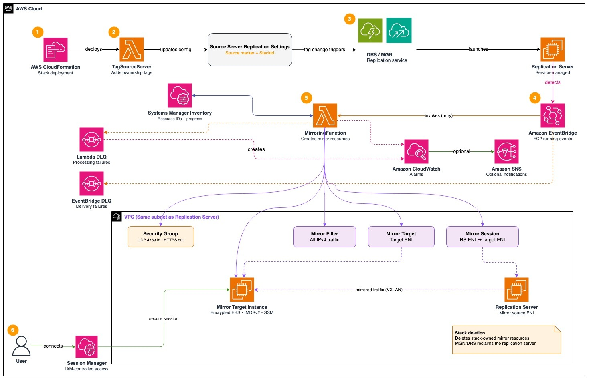

# Automated VPC Traffic Mirroring for AWS Transform MGN and AWS Elastic Disaster Recovery

This repository contains an AWS CloudFormation template that automates the configuration of [VPC Traffic Mirroring](https://docs.aws.amazon.com/vpc/latest/mirroring/what-is-traffic-mirroring.html) for troubleshooting replication issues in [AWS Application Migration Service](https://aws.amazon.com/application-migration-service/) (AWS Transform MGN) and [AWS Elastic Disaster Recovery](https://aws.amazon.com/disaster-recovery/) (AWS DRS).

## Important: read before deploying

This is sample code, for non-production usage. You should work with your security and legal teams to meet your organizational security, regulatory and compliance requirements before deployment.

This sample is provided as a starting point, not as a supported or production-ready solution. You are responsible for reviewing the template, verifying that it is correct and appropriate for your environment, and testing it before you use it. If you decide to deploy it in a production account, that decision and its consequences are yours, and you should make it only after your own review and approval.

Replication problems usually have to be diagnosed in the account and Region where the affected source server runs, which may be a production account. Before you deploy there, understand that this template:

- Changes the replication settings of an existing source server. The replication service then moves that source to a separate replication server.
- Creates IAM roles that can launch, configure, and delete EC2 and VPC Traffic Mirroring resources in the account until you delete the stack.
- Copies complete network packets from the replication server to a capture instance. Captures can contain sensitive data and must be handled as described in [Handling captured traffic data](#handling-captured-traffic-data).

Deploy the stack only for the troubleshooting window, and delete it when you finish.

## Overview

When troubleshooting replication issues in AWS Transform MGN or AWS DRS, packet capture from the replication server provides visibility into network communication between the source server and the staging area. Because replication servers are service-managed, standard network troubleshooting methods are not available. VPC Traffic Mirroring solves this by copying network traffic to a separate instance for analysis.

Configuring traffic mirroring manually takes over 20 minutes per source server and involves navigating across the MGN/DRS console, the EC2 console, and the VPC console. This CloudFormation template automates the entire process. You provide the source server ID and the service name, and the template handles everything else.

## Architecture



The diagram shows the deployment, StackId ownership gate, retry-safe exact-ID inventory, EventBridge retry and failure handling, monitoring, intentional all-IPv4 mirroring, hardened capture target, Session Manager access, and ownership-safe cleanup.

The template deploys an event-driven architecture:

1. AWS CloudFormation deploys the event-driven automation and its supporting resources.
2. The `TagSourceServer` custom-resource Lambda atomically claims a service/source-scoped Systems Manager ownership lock using `Overwrite=false`, then adds `Mirroring-{source-server-id}=yes` and `MirroringStackId={AWS::StackId}` to the source server's [replication settings](https://docs.aws.amazon.com/mgn/latest/ug/replication-settings-template.html). A second stack cannot pass the atomic claim while the first stack owns or is cleaning up the source.
3. The unique tag settings cause the replication service (MGN or DRS) to assign a separate service-managed replication server carrying those EC2 tags; the template preserves the existing `useDedicatedReplicationServer` value.
4. An Amazon EventBridge rule detects the replication server entering the running state and invokes the mirroring Lambda with an explicit retry policy and dedicated target-delivery DLQ.
5. The mirroring Lambda verifies the exact StackId and source-server tags. For AWS Transform MGN, it also requires the event instance to equal the selected source server's authoritative `dataReplicationInfo.replicatorId`. AWS DRS does not expose that field, so DRS retains the running-state, exact staging-subnet, ownership-tag, and single-primary-ENI checks. The Lambda then creates or reuses the security group, mirror-target EC2 instance, traffic mirror filter, target, and session. Exact IDs, lifecycle state, active setup invocation, and per-stage progress are persisted in a stack-owned Systems Manager Parameter Store inventory. A separate lifecycle parameter is writable only by cleanup, so setup cannot overwrite a `DELETING` decision. Retry identity is `StackId + SourceServerId + ReplicationServerId`; retries verify existing configuration and resume from the first incomplete stage. Before `RunInstances`, the Lambda persists a per-attempt client token so a timeout can recover the same launch; verified rollback clears it so a later attempt can launch a replacement. Resources created during a failed attempt are rolled back in reverse dependency order. Rollback attempts every cleanup step and raises a sanitized `RollbackIncomplete` signal when any resource remains, so Lambda retries, the DLQ, and alarms observe the incomplete rollback. Accepted invocations that exhaust Lambda retries go to a separate encrypted Lambda DLQ. CloudWatch alarms track Lambda errors, sustained throttling, both DLQs, and EventBridge failures. Notifications are disabled by default, with optional ALARM transitions to an existing customer-owned SNS topic.

6. You connect to the mirror target through AWS Systems Manager Session Manager and run a size-rotated packet capture until you choose to stop it with Ctrl+C.

On stack deletion, CloudFormation removes the EventBridge rule before cleanup. Cleanup writes a separate monotonic `DELETING` guard, refuses to race an active setup invocation, discovers any ownership-tagged resource whose ID was lost before inventory persistence, verifies the complete StackId/SourceServerId/ReplicationServerId tuple, and deletes only this stack's mirror target instance, security group, session, target, and filter. It does not terminate the service-managed replication server. The source ownership tags are removed only if they still carry this stack's exact StackId; deployment is rejected rather than taking ownership from another live stack. See [Cleanup](#cleanup).

## Prerequisites

- An AWS account with permissions to create CloudFormation stacks, Lambda functions, IAM roles, EC2 instances, and VPC Traffic Mirroring resources.
- An active source server in AWS Transform MGN or AWS DRS that has completed [replication initiation](https://docs.aws.amazon.com/mgn/latest/ug/replication-progress.html) (agent connected to replication server).
- The source server ID (starts with `s-`). Find it in the AWS Transform MGN or AWS DRS console under **Source servers**.

## Deployment

### Using the AWS Console

1. Download [replication-server-traffic-mirroring.yaml](replication-server-traffic-mirroring.yaml).
2. Open the [AWS CloudFormation console](https://console.aws.amazon.com/cloudformation/) in the same Region as your staging area.
3. Choose **Create stack** > **With new resources (standard)**.
4. Upload the template file and choose **Next**.
5. Enter a stack name and configure the parameters:

| Parameter | Required | Description |
|-----------|----------|-------------|
| ReplicationService | Yes | Select **AWS Transform MGN** or **AWS Elastic Disaster Recovery (DRS)** |
| SourceServerId | Yes | The source server ID (e.g., `s-1234567890abcdef0`) |
| MirrorTargetInstanceType | No | Instance type for the mirror target (default: `t3.small`) |
| AssignPublicIP | No | Assign a public IP to the mirror target (default: `false`). Set to `true` only when required. If `false`, the target subnet needs NAT or another private path to the Amazon Linux package repositories for tcpdump installation, plus NAT or VPC endpoints for `ssm` and `ssmmessages`. SSM endpoints alone do not provide package-repository access |
| EnableAlarmNotifications | No | Publish ALARM transitions to an existing SNS topic. Default: `false`; alarms and their OK/INSUFFICIENT_DATA history remain visible in CloudWatch when notifications are disabled |
| AlarmNotificationTopicArn | No | Existing customer-owned SNS topic ARN in the same account and Region when notifications are enabled. Use `NONE` when disabled. Cross-account delivery requires explicit security review and a compatible topic policy. The topic and subscriptions remain outside this stack's lifecycle |


`ReplicationService` and `SourceServerId` are immutable after stack creation. To troubleshoot another source or switch between MGN and DRS, delete this stack and create a new stack after cleanup completes. The stack refuses deployment when the selected source already carries a different `MirroringStackId`; it does not take ownership from another live stack. During a failed identity update, CloudFormation rolls the custom resource back before restoring its parameter-derived IAM policy. The tagging role therefore has read-only `GetReplicationConfiguration` access across MGN/DRS source-server resources so it can verify the original owned identity during rollback; `UpdateReplicationConfiguration` remains restricted to the single source selected by the current stack operation.

6. If you set `EnableAlarmNotifications=true`, paste an existing SNS topic ARN from the same account and Region into `AlarmNotificationTopicArn`. Ensure the topic already has the required subscriptions, encryption, and resource policy. The ARN pattern validates syntax but cannot dynamically enforce the current account; treat cross-account or cross-Region delivery as a separate reviewed design. Otherwise retain the defaults `false` and `NONE`.
7. Choose **Next**, then **Next** again.
8. Acknowledge that CloudFormation creates IAM resources and choose **Submit**.

#### Optional alarm notifications

The six CloudWatch alarms are always created. By default, notifications are disabled (`EnableAlarmNotifications=false`, `AlarmNotificationTopicArn=NONE`) and alarm state/history is available in the CloudWatch console. To enable notifications, provide an existing customer-owned SNS topic ARN in the same account and Region with confirmed subscriptions. The ARN pattern validates syntax but cannot dynamically enforce the current account; cross-account or cross-Region delivery requires separate security review and a compatible topic policy. Only `ALARM` transitions are published; `OK` and `INSUFFICIENT_DATA` transitions remain console-only to avoid startup and recovery noise. The stack only references the topic and never creates, modifies, subscribes to, encrypts, or deletes it.

The stack has two encrypted DLQs. The EventBridge target DLQ retains events that EventBridge could not deliver to Lambda; the Lambda DLQ retains accepted asynchronous invocations that still failed after Lambda retries. Investigate the corresponding alarm and logs before replay. For an EventBridge target-DLQ message, validate that the referenced instance still exists, is running, and carries the expected service/ownership context before reinvoking the mirroring Lambda. Delete the message only after successful replay or after confirming it is an irrelevant/stale EC2 event.

### Using the AWS CLI

The template is larger than the 51,200-byte inline `--template-body` limit. Use `cloudformation deploy` with an existing private S3 bucket so the AWS CLI can upload the template automatically.

The bucket must:

- Already exist; this command does not create it.
- Be in the same AWS Region as the CloudFormation stack and the MGN/DRS staging environment.
- Have S3 Block Public Access enabled and encryption at rest configured.
- Allow the deploying identity to upload and read the template object.

```bash
aws cloudformation deploy \
  --stack-name traffic-mirroring \
  --template-file ./replication-server-traffic-mirroring.yaml \
  --s3-bucket <existing-private-template-bucket> \
  --s3-prefix cloudformation/vpc-traffic-mirroring \
  --parameter-overrides \
    ReplicationService="AWS Elastic Disaster Recovery (DRS)" \
    SourceServerId=s-1234567890abcdef0 \
  --capabilities CAPABILITY_NAMED_IAM \
  --region us-east-1
```

Replace the bucket name, source-server ID, replication service, and Region for your environment. Parameters with defaults—such as the mirror-target instance type, public-IP setting, and alarm notification settings—can be omitted unless you want to override them. The `deploy` command can create a new stack or update an existing stack of the same name.

### What happens after deployment

1. The stack creates and provisions all resources.
2. The replication service assigns a separate service-managed replication server because the source-specific staging tags make its replication settings unique.
3. EventBridge detects the new replication server and triggers the Lambda function.
4. The Lambda creates the mirror target instance and all traffic mirroring resources.

> **Verify bootstrap before capture.** CloudFormation confirms that the EC2 instance is running, but it does not wait for cloud-init package installation to finish. If the subnet cannot reach the Amazon Linux repositories, the stack can complete while tcpdump and the helper scripts remain unavailable. HTTPS security-group egress authorizes the protocol but does not create NAT routes or VPC endpoints. Check the target before collecting traffic:
>
> ```bash
> sudo cloud-init status --long
> if sudo test -x /var/lib/traffic-capture/capture-traffic.sh; then
>   echo "PASS: capture helper exists and is executable"
> else
>   echo "FAIL: capture helper is missing or not executable"
> fi
> sudo tcpdump --version
> ```
>
> Bootstrap is ready when `cloud-init status --long` reports `status: done` with no errors, the helper check prints `PASS`, and `sudo tcpdump --version` succeeds. If cloud-init is still running, wait and repeat the checks. If it reports an error, the helper prints `FAIL`, or the tcpdump command fails, inspect `/var/log/cloud-init-output.log` and correct the bootstrap or network issue before collecting traffic.
>
> If these checks fail, correct the repository/SSM network path and recreate the stack. The five-minute package-install timeout prevents cloud-init from waiting indefinitely.

## Usage

### Connect to the mirror target instance

Use Session Manager from the EC2 console, or the AWS CLI:

```bash
aws ssm start-session --target <mirror-target-instance-id>
```

Treat `ssm:StartSession` on the mirror target as administrative access to every capture on that instance. The default Linux Session Manager user can use sudo, so filesystem ownership does not isolate PCAPs from an authorized session operator. Restrict session access to approved responders and the stack-owned target tag. For example, apply the resource-tag condition to the managed-instance permission, with separate access to your approved Session Manager document:

```json
{
  "Effect": "Allow",
  "Action": "ssm:StartSession",
  "Resource": "arn:aws:ec2:<region>:<account-id>:instance/*",
  "Condition": {
    "StringEquals": {
      "ssm:resourceTag/StackId": "<cloudformation-stack-id>"
    }
  }
}
```

Also restrict `ssm:ResumeSession` and `ssm:TerminateSession` to the responder's own session ARNs. Validate the condition key and session-document policy against your organization's Session Manager configuration before deployment.

### Capture traffic

The template installs tcpdump and places root-owned helper scripts in `/var/lib/traffic-capture/`. Capture files are written under `/var/lib/traffic-capture/captures/`, a restricted directory owned by the `tcpdump` service account. This separation is required because both helpers explicitly use `tcpdump -Z tcpdump`, which drops the capture process to the `tcpdump` account before opening rotated output files.

**View live traffic:**

```bash
sudo /var/lib/traffic-capture/view-traffic.sh
```

**Capture to rotating pcap files:**

```bash
sudo /var/lib/traffic-capture/capture-traffic.sh
```

The helper runs until you press Ctrl+C. It allows only one managed capture process at a time and refuses to start while any prior helper-managed capture set remains. tcpdump rotates at 100 MB and retains at most five files, named `/var/lib/traffic-capture/captures/capture-YYYYMMDD-HHMMSS.pcap0` through `.pcap4`. Review and delete the existing set before starting another helper run.

**Run tcpdump with custom options:**

```bash
sudo tcpdump -nn -tt -vv \
  host <replication-server-private-ip> \
  -C 100 -W 5 \
  -w /var/lib/traffic-capture/captures/custom-capture.pcap
```


The custom command is operator-controlled. Its 100-MB/five-file limits apply only while `-C 100 -W 5` are retained, and it does not use the helper's concurrency lock or prior-set check. Do not run it concurrently with the helper or another capture. Stop it with Ctrl+C and remove the files promptly when the investigation is complete.
The replication server IP is stored in `/var/lib/traffic-capture/replication-server-ip.txt`.

### Analyze the capture

Transfer the pcap file to your local machine and open it in [Wireshark](https://www.wireshark.org/) to look for SSL/TLS interception, MTU/MSS mismatches, firewall-injected flags, or blocked connections.

### Handling captured traffic data

**What the capture contains.** The VPC Traffic Mirror filter copies complete **IPv4** packets visible on the replication-server ENI in both directions and does not set `PacketLength`. It does not include IPv6 (`::/0` rules are not configured), so do not interpret the PCAP as complete visibility for IPv6 traffic. The expected AWS Transform MGN / AWS DRS replication payload is encrypted in transit, but DNS, endpoint dependencies, unexpected protocols, or other traffic on that ENI may contain cleartext content. The tcpdump `host <replication-server-private-ip>` expression matches the outer VXLAN transport from the replication server; it does not narrow the encapsulated mirrored packet scope. Classify and protect the complete PCAP at the highest sensitivity represented by any captured traffic, not only the expected encrypted replication stream.

**Controls built into the template:**

- The mirror-target instance's root volume is **encrypted at rest** (EBS encryption), so pcap files written to it are encrypted.
- The instance **requires IMDSv2** (token-backed metadata; IMDSv1 disabled).
- No public IP is assigned by default (`AssignPublicIP` defaults to `false`); access is through AWS Systems Manager Session Manager only.
- The target security group removes EC2's default allow-all outbound rule and permits only TCP/443 egress. This supports SSM and repository HTTPS but does not create NAT routes, proxies, or endpoints.
- The stack resolves a current Amazon Linux 2023 AMI and installs the current repository build of tcpdump. It intentionally does not run a full OS upgrade during cloud-init because that increases bootstrap duration, repository dependency, and runtime package drift. Apply your organization's AMI patching process or use an approved prebuilt AMI design when zero-egress or stricter patch control is required.
- The VPC Traffic Mirror filter intentionally mirrors all IPv4 protocols and ports in both directions on the replication-server ENI. The replication server is service-managed and cannot be accessed directly; complete visibility is required to troubleshoot both source-to-RS replication traffic and RS connectivity to MGN/DRS service endpoints, DNS, and other dependencies. This follows the original [Part 1 manual procedure](https://aws.amazon.com/blogs/migration-and-modernization/configure-aws-vpc-traffic-mirroring-to-troubleshoot-replication-errors-in-aws-mgn-and-aws-drs/), which explicitly mirrors all inbound and outbound replication-server traffic and configures `0.0.0.0/0` source and destination CIDRs in both directions.
- The capture helper matches the outer RS VXLAN transport, allows only one managed capture at a time using `flock`, refuses to start while a prior helper-managed capture set remains, and uses five 100-MB rotating files. This bounds helper-managed storage to one approximately 500-MB set. The user controls capture duration with Ctrl+C.
- The writable capture directory is restricted to the `tcpdump` service account; helper scripts and the replication-server reference file remain root-owned.

**Your responsibilities for any capture you create:**

- **Classification**: Classify pcap files at the sensitivity level of the traffic they contain. When in doubt, treat them as confidential.
- **Access**: The capture files sit on the mirror target instance under `/var/lib/traffic-capture/captures/` and are reachable only through Session Manager, governed by your IAM permissions. Restrict who can start a session to that instance. Do not widen the security group or attach a public IP unless you need it, and remove that access when you finish.
- **Session transcripts**: This sample does not change account-wide Session Manager preferences and intentionally grants no S3, CloudWatch Logs, or KMS destination permissions to the target role because it cannot know the customer-owned destination. Enabling transcript preferences alone may therefore be insufficient. Add a customer-managed policy scoped to the exact transcript S3 bucket/prefix or CloudWatch log group and, when applicable, the exact KMS key (`kms:GenerateDataKey*`/required decrypt context). Treat transcripts as sensitive operational evidence because commands, paths, and decoded packet output can appear in them. Remove destination permissions when troubleshooting ends.
- **Scope and purpose**: Full IPv4 ingress/egress mirroring is intentional because limiting capture to TCP port 1500 would hide failures between the replication server and MGN/DRS endpoints or supporting services. The target receives complete encapsulated IPv4 packets visible on the RS ENI, and some non-replication traffic may be cleartext. Run tcpdump only for the investigation window, stop it with Ctrl+C, and minimize retention.
- **Analyze in place first**: Use Session Manager to inspect capture metadata with `tcpdump -r` before transferring a file. Session Manager provides the authenticated administrative shell; it is not itself a direct file-copy command.
- **Secure S3 retrieval when transfer is necessary**: Use a customer-controlled S3 bucket with Block Public Access, default encryption, and restricted reader access. Temporarily grant the mirror-target role only `s3:PutObject` and `s3:AbortMultipartUpload` on one investigation-specific bucket prefix, upload with `aws s3 cp <capture> s3://<bucket>/<prefix>/ --sse AES256`, verify the object, and immediately remove the temporary permission. Do not grant `s3:*`, reuse a broad shared prefix, email captures, or place them on unencrypted storage.
- **Encryption at rest**: The instance volume is encrypted. For S3, retain bucket default encryption and use SSE-S3 or an approved SSE-KMS key. Store any local copy only on encrypted disk.
- **Retention and deletion**: Keep captures only for as long as the investigation needs them. Delete instance files with `rm -f /var/lib/traffic-capture/captures/*.pcap*`; on EBS/SSD this is logical deletion, not a physical-erasure guarantee. Terminating the encrypted mirror-target EBS volume through stack deletion is the local-storage disposal boundary. Delete every exported copy as well, including S3 object versions and lifecycle-retained versions, workstation backups, Wireshark temporary/autosave files, and copies retained by transfer or endpoint tooling. Configure S3 version expiration where versioning is enabled. Session Manager transcripts, when enabled in the customer account preferences, have their own destination, encryption, access, and retention configuration and must be managed separately.

## Cleanup

Delete the CloudFormation stack to remove all stack-owned resources:

```bash
aws cloudformation delete-stack --stack-name traffic-mirroring
```

The stack deletion runs cleanup that:

- Atomically refuses stack creation when another StackId owns the service/source lock. The lock remains until cleanup removes every stack-owned resource. Source tags are removed only when they still carry this stack's exact ownership value.
- Deletes the EventBridge rule before cleanup, writes a separate monotonic `DELETING` lifecycle guard that setup cannot overwrite, and fails closed if an accepted setup invocation is still active.
- Reads the stack-owned inventory and discovers generated resources by StackId and SourceServerId before deletion. Missing IDs are reconstructed from the complete ownership tuple; duplicate or malformed ownership fails deletion rather than guessing. Cleanup then deletes the traffic mirror session, target, filter, mirror-target instance, and security group.
- Deletes the inventory parameter, Lambda and EventBridge DLQs, six CloudWatch alarms, and Lambda log groups through CloudFormation.

**The replication server used for troubleshooting is not terminated by this stack.** It is launched and owned by AWS Transform MGN / AWS DRS, not by this template. Once the source ownership tags are removed, that temporary replication server becomes orphaned, and AWS Transform MGN / AWS DRS terminates it during routine orphaned-replication-server cleanup. To reclaim it immediately, terminate that instance manually from the Amazon EC2 console.

If the cleanup function cannot delete a resource, it reports the stack deletion as failed and lists the resources it left behind, rather than reporting a clean deletion over a partial cleanup. If that happens, check the cleanup function's CloudWatch logs, remove the named resources, and delete the stack again.

The ownership lock is stored at `/vpc-traffic-mirroring/ownership/mgn/<source-server-id>` for AWS Transform MGN or `/vpc-traffic-mirroring/ownership/drs/<source-server-id>` for AWS DRS. A failed or abandoned delete intentionally retains this lock, so a later deployment receives `SourceAlreadyOwned` instead of taking over resources that may still exist. Delete the lock manually only after confirming that the owning stack has been abandoned, no stack operation or setup invocation is running, every resource carrying that StackId and SourceServerId has been removed, and the source server no longer carries the abandoned ownership tags. Never delete the lock only to bypass `SourceAlreadyOwned`.

Deleting the stack discards the pcap files on the mirror target instance because the instance is terminated. It does not delete captures you transferred to Amazon S3 or your workstation. Delete those yourself (see [Handling captured traffic data](#handling-captured-traffic-data)). Delete the stack after you finish collecting packet captures to avoid additional costs.

## Cost

The template creates the following billable resources:

- 1 EC2 instance (mirror target, default `t3.small`)
- 1 service-managed replication server launched by AWS Transform MGN / AWS DRS as a consequence of the unique replication settings. Once stack deletion removes the source ownership tags, that temporary server becomes orphaned. AWS Transform MGN / AWS DRS terminates it during routine orphaned-replication-server cleanup, or you can reclaim it immediately by terminating it manually from the Amazon EC2 console.
- VPC Traffic Mirroring session
- Lambda function invocations
- SQS requests for the two dead-letter queues (effectively zero unless delivery or processing fails repeatedly)
- Two stack-owned standard Systems Manager parameters for exact-ID inventory and the monotonic lifecycle guard, plus one temporary service/source ownership-lock parameter retained until cleanup completes
- Six CloudWatch alarms and CloudWatch Logs storage
- Optional publishes to an existing SNS topic when enabled; this stack creates no SNS topic or subscription

Amazon EventBridge has no cost for this template. The EventBridge rule matches EC2 state-change events on the [default event bus](https://aws.amazon.com/eventbridge/pricing/), which are free.

Costs depend on your Region and the duration the resources are running. Delete the stack after completing your analysis.

## Security

See [CONTRIBUTING](CONTRIBUTING.md#security-issue-notifications) for more information.

## License

This library is licensed under the MIT-0 License. See the [LICENSE](LICENSE) file.
